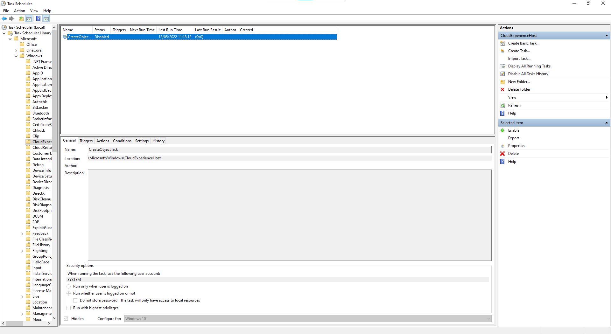
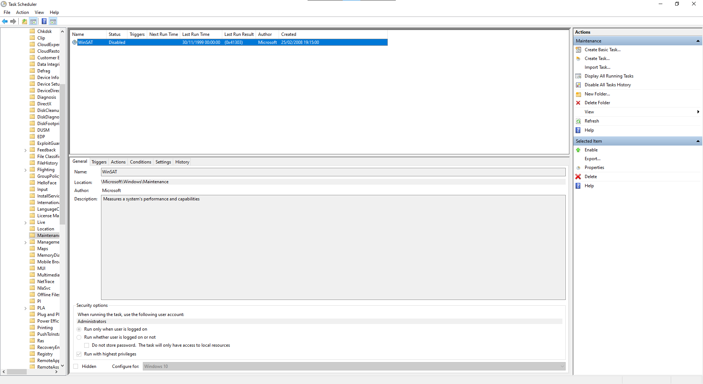
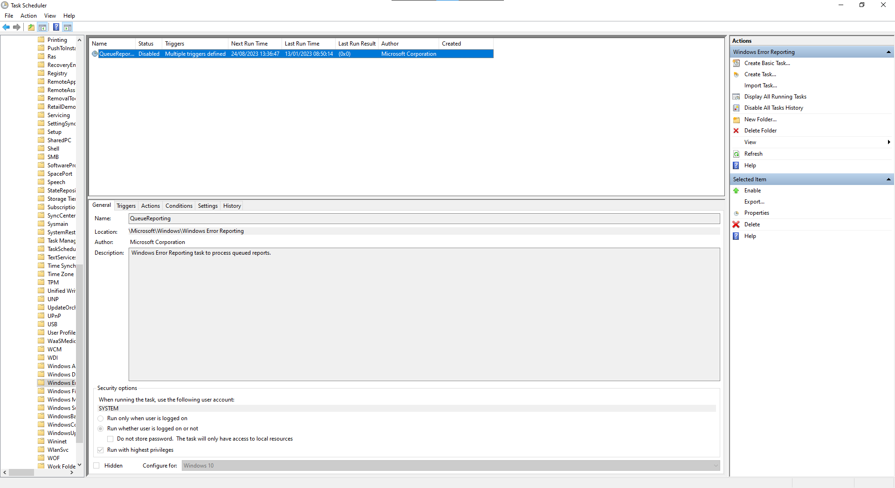
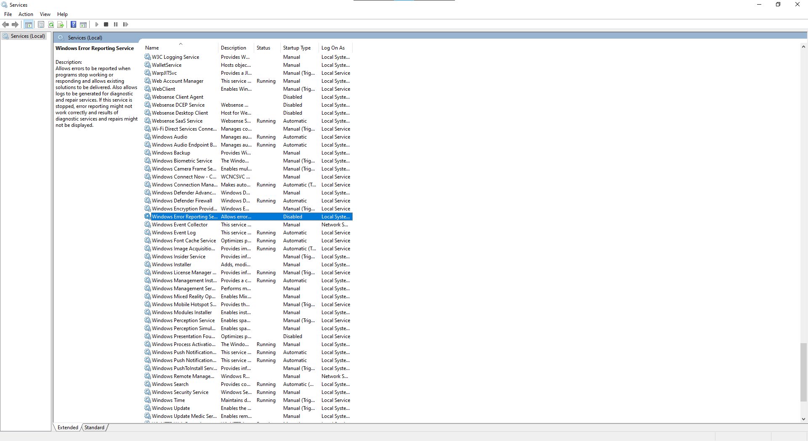
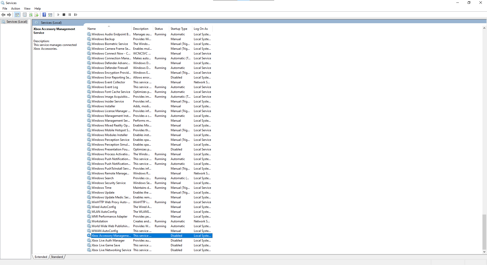
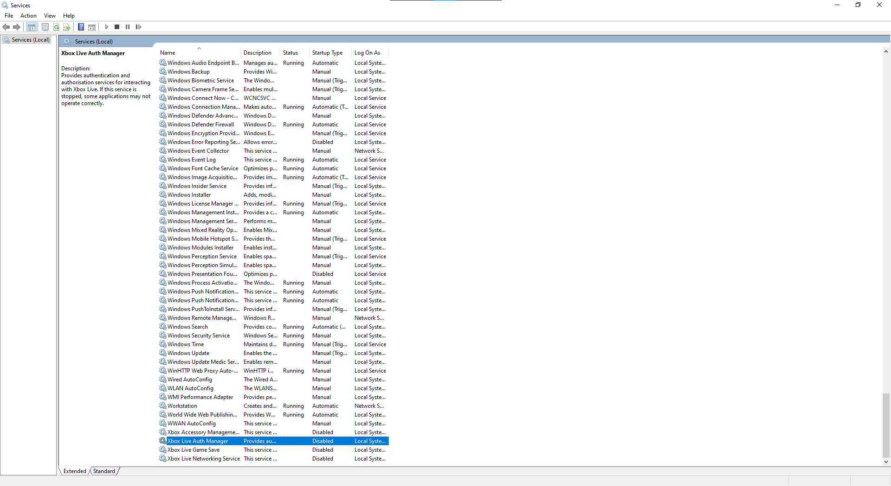
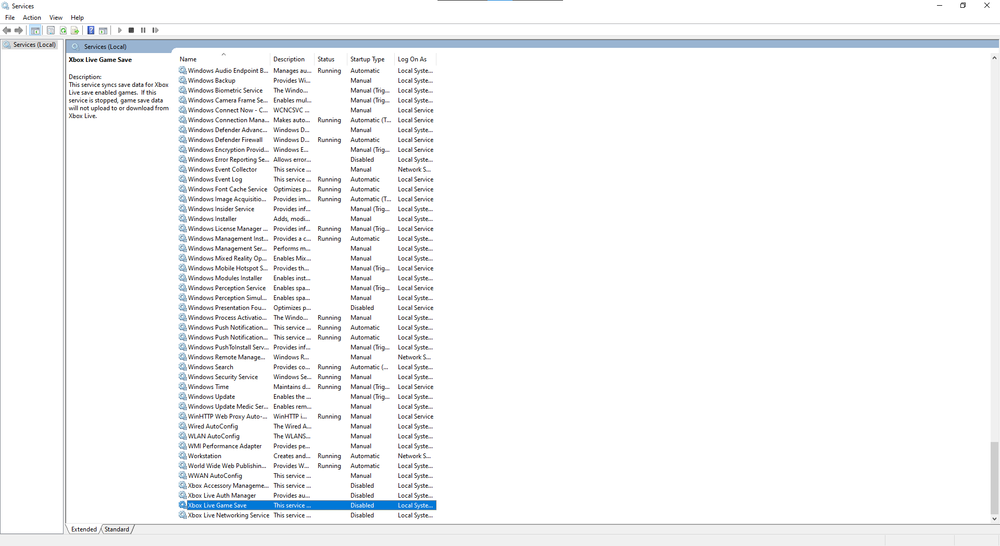
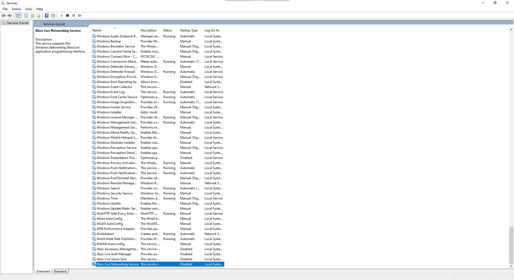

# Fix-FireEye.ps1

What the script does:

Checks if it is ran with Administrator rights otherwise it exits.

_Task Scheduler_

Disables `Office ClickToRun Service Monitor`, `OfficeTelemetryAgentFallBack2016` and `OfficeTelemetryAgentLogOn2016` .

Disables `MareBackup`, `Microsoft Compatibility Appraiser`, `PcaPatchDbTask`, `ProgramDataUpdater` and `StartupAppTask`.

Disables `Proxy`.

Disables `Create Object Task`.

Disables `Consolidator`, `KernelCeipTask` (only found in Windows 7) and `UsbCeip`.

Disables `WinSAT`.

Disables `QueueReporting`.

_Services_

Disables `Windows Error Reporting`.

Disables `Xbox Accessory Management Service`.

Disables `Xbox Live Auth Manager`.

Disables `Xbox Live Game Service`.

Disables `Xbox Live Networking Service`.

